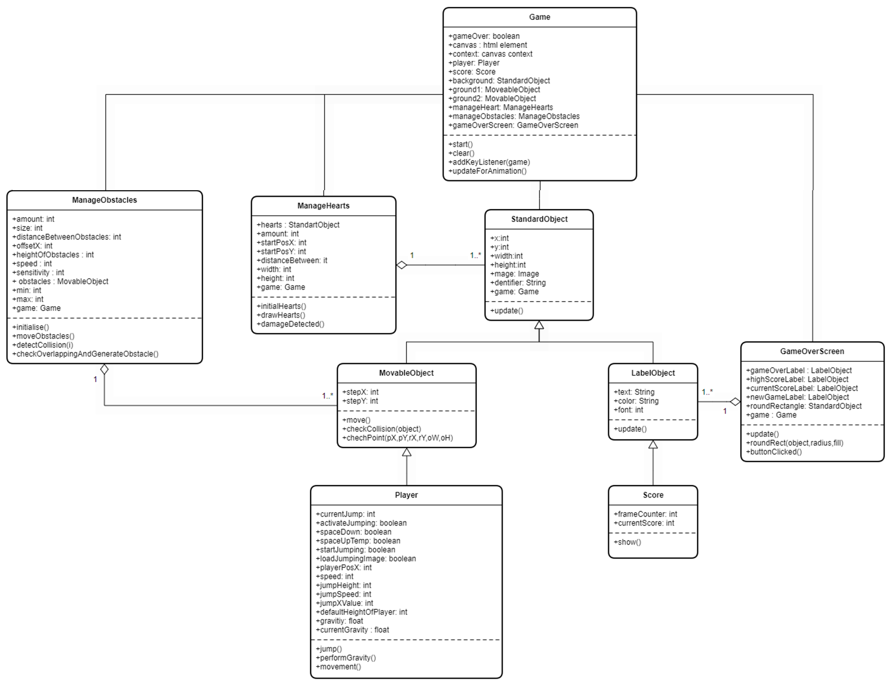
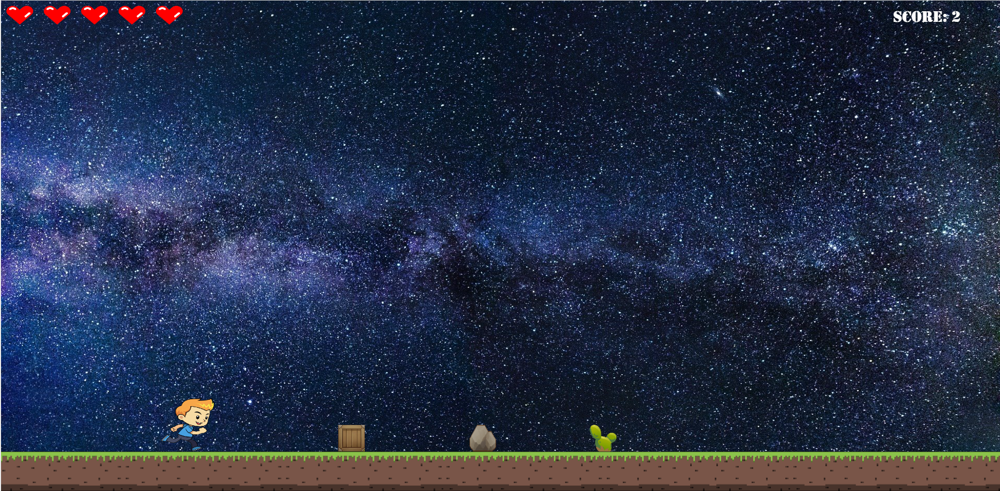

# InfinityRunner

## Description

This Game is about a runner, that has to jump over objects. From time to time, the runner gets faster and there are objects in the sky, which have to be dodged.
At the start, the runner receives 5 Hearts. If the runner collides with an object, one heart will be lost. 
The runner is dynamic, which means that the style is changed by moving. So there is a style for jumping and moving.
If all Hearts are lost, there will be a game over frame with the highscore. So the goal of the game is to reach the high score. 
The high score is being saved with local storage, which helps us to save the score with no expiration date, so the score will even be saved after closing the browser.
The Player can be controlled by pressing "space" for jumping.

## OOP UML Model

## Installation

The only thing that has to be done, is to clone the git project.
All Files are in the git project. The scripts are using relatives paths, so there shouldn't be any problems regarding loading the files. 

## Project Structure

The Game is written in HTML, CSS and JavaScript.
Each functionality is separated in different scripts. For example the movement script, gravity script and the animation script for the player.
Also, the textures are separated. 

## Visuals

## Project status
The project was completed

## Authors
@5917010406 (Kotoric Mensur) 
@5848170106 (Zidej Dominik)
